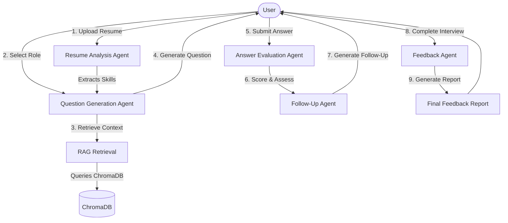

# AI-Powered Smart Interview Simulator using RAG and Multi-Agent AI

An advanced technical interview simulator that parses candidate resumes, retrieves role-specific interview questions using a Retrieval-Augmented Generation (RAG) pipeline, conducts interactive mock interviews, and generates detailed evaluation reports using local LLMs (via Ollama).

## Architecture Overview



## Folder Structure

```
AI-Smart-Interview-Simulator/
├── frontend/             # Streamlit application pages
├── backend/              # Core logic and server scripts
├── agents/               # Multi-Agent logic definitions
│   ├── resume_agent.py
│   ├── qgen_agent.py
│   ├── eval_agent.py
│   ├── followup_agent.py
│   └── feedback_agent.py
├── scraper/              # Data collection and cleaning
│   ├── scraper.py
│   ├── cleaner.py
│   └── compile_kb.py
├── rag_pipeline/         # LangChain & Chroma RAG setup
├── vector_db/            # ChromaDB vector store directory
├── datasets/             # Data directory
│   ├── raw/              # Scraped raw questions
│   ├── cleaned/          # Cleaned question files
│   └── processed/        # Unified knowledge base CSV
├── reports/              # Generated feedback reports (PDF/JSON)
├── tests/                # Unit and integration tests
├── docs/                 # Documentation and design assets
├── app.py                # Streamlit entry point
├── requirements.txt      # Project requirements
└── README.md             # Project documentation
```

## Getting Started

1. **Clone the Repository**:
   ```bash
   git clone <repo-url>
   cd AI-Smart-Interview-Simulator
   ```

2. **Set up Virtual Environment**:
   ```bash
   python -m venv venv
   .\venv\Scripts\Activate.ps1
   ```

3. **Install Dependencies**:
   ```bash
   pip install -r requirements.txt
   ```

4. **Run Data Collection**:
   ```bash
   python scraper/scraper.py
   python scraper/cleaner.py
   python scraper/compile_kb.py
   ```

5. **Start Ollama Local LLM**:
   Make sure Ollama is installed and running with:
   ```bash
   ollama run mistral
   ```

6. **Start Streamlit App**:
   ```bash
   streamlit run app.py
   ```
