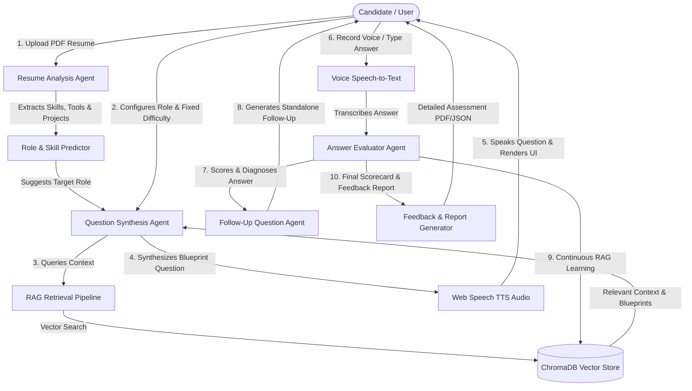

# 🤖 AI-Powered Smart Technical Interview Simulator

An enterprise-grade, multi-agent technical interview simulation platform powered by **Retrieval-Augmented Generation (RAG)**, **Groq Cloud API (`llama-3.3-70b-versatile`)**, **ChromaDB Vector Store**, and **Streamlit**.

---

### 🌐 Live Application Link
- **Deployed URL:** [http://13.232.51.191](http://13.232.51.191)

---

## 📌 Domain
**Artificial Intelligence / Generative AI / EdTech & Automated Assessment Systems**

---

## 🎯 Problem Statement
Traditional technical mock interview tools and static question banks are generic, lack domain specificity, and fail to simulate real-world technical grilling. Candidates struggle to get personalized, role-aligned feedback based on their actual resume projects, exact tech stack, and difficulty requirements. Furthermore, human mock interviews are expensive, non-scalable, and inconsistent in evaluation metrics.

---

## 🚀 Objective
To engineer an autonomous, scalable, multi-agent AI interview platform that:
1. **Parses candidate resumes** to extract technical skills, domain expertise, tools, and project descriptions.
2. **Predicts and matches target engineering roles** across 50+ specialized disciplines (Data/AI, Cloud/DevOps, Software/Systems, Cyber Security).
3. **Retrieves domain-specific technical knowledge** via a high-performance RAG pipeline using ChromaDB vector database.
4. **Enforces strict difficulty controls** (Easy, Medium, Hard) to ensure question complexity never drifts.
5. **Provides hands-free voice-based interviewing** with real-time speech-to-text transcription and auto-spoken audio feedback.
6. **Generates diagnostic scorecards** and performance evaluation reports with continuous RAG vector store learning.

---

## 🛠️ Tech Stack

| Domain | Technologies & Libraries |
| :--- | :--- |
| **LLM Engine & Multi-Agent** | Groq Cloud API (`llama-3.3-70b-versatile`), LangChain, CrewAI, Ollama (Local Fallback) |
| **RAG & Vector Database** | ChromaDB, HuggingFace Sentence-Transformers (`all-MiniLM-L6-v2`), LangChain VectorStore |
| **User Interface & Audio** | Streamlit, Web Speech API (Bi-Directional Voice TTS & STT) |
| **Data Scraping & Processing** | Python 3.12, BeautifulSoup4, PyPDF2, Pandas, Requests |
| **Cloud & Deployment** | AWS EC2 (`m7i-flex.large`), Nginx Reverse Proxy, Systemd, Ubuntu 24.04 LTS |

---

## Key Features

- 📄 **Precise Skill & Project Parsing**: Analyzes uploaded PDF resumes using regex domain maps and LLM extraction to isolate tech stacks, tools, and project descriptions.
- 🎯 **50+ Engineering Role Support**: Auto-predicts target roles and supports specialized blueprints across Software, Cloud, DevOps, Machine Learning, Data Engineering, and Security.
- 🔒 **Strict Fixed Difficulty Lock**: Enforces exact difficulty tiers (Easy: Definitions/Basics, Medium: Practical/Scenarios, Hard: System Design/Architecture) without dynamic difficulty drift.
- 🧠 **RAG-Powered Context Retrieval**: Queries ChromaDB vector database for verified domain knowledge, preventing LLM hallucinations.
- 🔄 **Cross-Session Question Non-Repetition**: Tracks asked questions globally to guarantee zero repeated questions across sessions.
- 🎙️ **Bi-Directional Voice Interface**: Hands-free speech recognition (STT) into text areas and native auto-spoken audio (TTS) question playback.
- 📊 **Independent Follow-Up Question Evaluation**: Evaluates main and follow-up responses independently, generating diagnostic performance scorecards.
- 🚀 **Continuous RAG Learning**: Automatically feeds evaluated candidate Q&A pairs back into the ChromaDB vector database to continuously expand the knowledge base.

---

## 🏛️ System Architecture Overview



---

## 📂 Dataset & Input Sources

1. **Scraped Technical Blueprints**: Technical interview questions scraped and cleaned across 50+ engineering domains (`datasets/raw/` & `datasets/cleaned/`).
2. **Unified Knowledge Base**: Processed CSV knowledge base (`datasets/processed/unified_knowledge_base.csv`) compiled into ChromaDB vector embeddings.
3. **Candidate Resumes**: User-uploaded PDF technical resumes parsed at runtime.

---

## 💻 Installation and Execution

### Local Setup (Windows / Linux / macOS)

1. **Clone the Repository**:
   ```bash
   git clone https://github.com/atharva-sunbeam/AI-Smart-Interview-Simulator.git
   cd AI-Smart-Interview-Simulator
   ```

2. **Create & Activate Virtual Environment**:
   - **Windows (PowerShell):**
     ```powershell
     python -m venv venv
     .\venv\Scripts\Activate.ps1
     ```
   - **Linux / macOS:**
     ```bash
     python3 -m venv venv
     source venv/bin/activate
     ```

3. **Install Dependencies**:
   ```bash
   pip install --upgrade pip
   pip install -r requirements.txt
   ```

4. **Configure Environment Variables**:
   Create a `.env` file in the root directory:
   ```env
   GROQ_API_KEY=your_groq_api_key_here
   ```

5. **Seed Knowledge Base Vector Store**:
   ```bash
   python -m scraper.seed_knowledge
   ```

6. **Run Streamlit Web Application**:
   ```bash
   streamlit run app.py
   ```
   Open `http://localhost:8501` in your browser.

---

## 🔄 End-to-End Workflow

```
[Resume Upload] -> [Skill & Project Extraction] -> [Role Prediction & Parameter Selection]
                                                               ↓
                                               [RAG Vector Knowledge Query]
                                                               ↓
                                             [Topic Blueprint Question Synthesis]
                                                               ↓
                                         [Voice Playback & Hands-Free Recording]
                                                               ↓
                                             [Independent Technical Evaluation]
                                                               ↓
                                              [Follow-Up Question Handling]
                                                               ↓
                                       [Diagnostic Scorecard & Continuous Learning]
```

---

## 🔮 Future Enhancements

- 🌐 **Multi-Lingual Interview Support**: Add support for non-English technical mock interviews.
- 💻 **Interactive Coding Sandbox**: Integrate an online code editor (Monaco/Ace) with automated unit test execution.
- 📹 **Multimodal Emotion & Confidence Analysis**: Facial posture and tone analysis during video mock interviews.
- 🏢 **Enterprise Recruiter Analytics Dashboard**: Centralized applicant scoring and talent match dashboards for hiring managers.

---

## 👥 Authors & Contact Information

- **Shreyas Deshingkar** — Email: [shreyasdeshingkar@gmail.com](mailto:shreyasdeshingkar@gmail.com)
- **Atharva Birje** — Email: [atharvapersonal234@gmail.com](mailto:atharvapersonal234@gmail.com)

---

## 📌 Conclusion
The **AI-Powered Smart Technical Interview Simulator** bridges the gap between static preparation resources and dynamic technical evaluations. By combining Multi-Agent LLMs with Retrieval-Augmented Generation, strict difficulty controls, bi-directional voice interfaces, and continuous RAG database learning, it delivers a realistic, scalable, and highly accurate mock interview platform for modern software engineering candidates.
