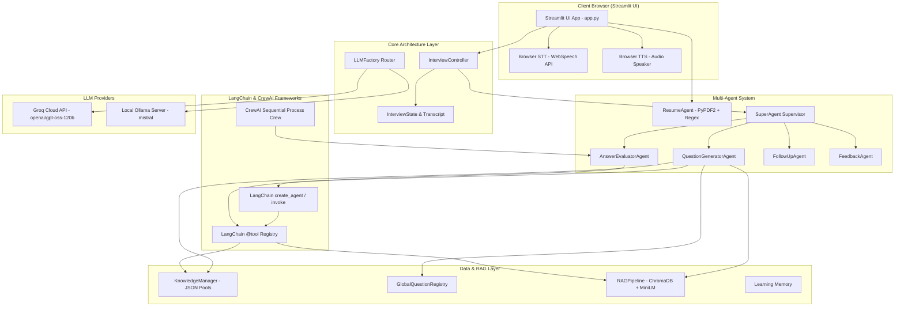

# 🤖 AI-Powered Smart Technical Interview Simulator

An enterprise-grade, multi-agent technical interview simulation platform powered by **LangChain**, **CrewAI**, **Retrieval-Augmented Generation (RAG)**, **Groq Cloud API (`openai/gpt-oss-120b`)**, **ChromaDB Vector Store**, and **Streamlit**.

---

### 🌐 Live Application Link
- **Production HTTPS URL:** [https://ai-interview-sim.duckdns.org](https://ai-interview-sim.duckdns.org)
- **AWS Elastic IP:** `http://43.205.63.85`

---

## 📌 Domain
**Artificial Intelligence / Generative AI / EdTech & Automated Assessment Systems**

---

## 🎯 Problem Statement
Traditional technical mock interview tools and static question banks are generic, lack domain specificity, and fail to simulate real-world technical grilling. Candidates struggle to get personalized, role-aligned feedback based on their actual resume projects, exact tech stack, and difficulty requirements. Furthermore, human mock interviews are expensive, non-scalable, and inconsistent in evaluation metrics.

---

## 🚀 Objective
To engineer an autonomous, scalable, multi-agent AI interview platform that:
1. **Parses candidate resumes** to extract exact technical skills, domain expertise, tools, and project descriptions without false positives.
2. **Predicts and matches target engineering roles** across 50+ specialized disciplines (Data/AI, Cloud/DevOps, Software/Systems, Cyber Security).
3. **Retrieves domain-specific technical knowledge** via a high-performance RAG pipeline using ChromaDB vector database.
4. **Executes production LangChain & CrewAI pipelines** for agent reasoning (`create_agent`, `@tool` invocations, `Process.sequential` crew execution).
5. **Enforces strict difficulty controls** (Easy, Medium, Hard) to ensure question complexity never drifts.
6. **Provides hands-free voice-based interviewing** with real-time speech-to-text transcription (STT) and auto-spoken audio playback (TTS) over HTTPS.
7. **Offers explicit candidate control** with 3-4 sentence comprehensive diagnostic feedback, expected key terminologies, and dual action choices (*Follow-Up Question* or *Next Question*).
8. **Generates diagnostic scorecards** and performance evaluation reports with continuous RAG vector store learning.

---

## 🛠️ Tech Stack

| Domain | Technologies & Libraries |
| :--- | :--- |
| **Agent & Execution Layer** | LangChain (`create_agent`, `@tool`), CrewAI (`Agent`, `Task`, `Crew`, `Process.sequential`) |
| **LLM Engine Router** | Groq Cloud API (`openai/gpt-oss-120b`), Ollama (`mistral` Local Fallback), Offline Overlap Heuristics |
| **RAG & Vector Database** | ChromaDB, HuggingFace Sentence-Transformers (`all-MiniLM-L6-v2`), LangChain VectorStore |
| **User Interface & Audio** | Streamlit, Web Speech API (Bi-Directional Voice TTS & STT over Secure HTTPS) |
| **Data Extraction & Processing** | Python 3.10+, PyPDF2, Regex (`re` word boundaries), Pandas, JSON |
| **Cloud Infrastructure & Security** | AWS EC2 (`c7i-flex.large`), Elastic IP, Nginx Reverse Proxy, Let's Encrypt SSL (Certbot), Systemd |

---

## Key Features

- 📄 **Precise Skill & Project Parsing**: Analyzes uploaded PDF resumes using strict regex word boundaries (`(?:\b|_)`) and LLM extraction to isolate exact tech stacks without false positive skill leakage.
- 🎯 **50+ Engineering Role Support**: Auto-predicts target roles and supports specialized blueprints across Software, Cloud, DevOps, Machine Learning, Data Engineering, and Security.
- 🔒 **Strict Fixed Difficulty Lock**: Enforces exact difficulty tiers (Easy: Definitions/Basics, Medium: Practical/Scenarios, Hard: System Design/Architecture) without dynamic difficulty drift.
- 🧠 **RAG-Powered Context Retrieval**: Queries ChromaDB vector database for verified domain knowledge, preventing LLM hallucinations.
- 🦜🔗 **Production LangChain Integration**: Executes real `create_agent()` reasoning and `@tool` functions (`retrieve_knowledge`, `retrieve_role_questions`, `retrieve_resume_context`, `evaluate_answer_tool`).
- 👥 **CrewAI Multi-Agent Pipeline**: Runs `Question Strategy Agent`, `Answer Evaluation Agent`, and `Report Generation Agent` sequentially via `crew.kickoff()`.
- 🔄 **Cross-Session Question Non-Repetition**: Persistent `GlobalQuestionRegistry` tracking asked questions globally to guarantee zero repeated questions across sessions.
- 🎙️ **Bi-Directional Voice Interface**: Hands-free speech recognition (STT) into text areas and native auto-spoken audio (TTS) question/feedback playback under HTTPS secure context.
- 📝 **Rich Diagnostic Feedback**: Evaluates main and follow-up responses independently, generating 3-4 sentence detailed explanations, expected key terminologies, and score breakdowns.
- 🚀 **Continuous RAG Learning**: Automatically feeds evaluated candidate Q&A pairs back into the ChromaDB vector database to continuously expand the knowledge base.

---

## 🏛️ System Architecture Overview



---

## 📂 Project Structure

```
.
├── app.py                      # Main Streamlit Web Application Entry Point
├── core/                       # Core Controller & Session State Layer
│   ├── interview_controller.py # Controller managing interview steps & state
│   ├── interview_state.py      # Dataclasses for transcripts & scorecards
│   └── llm_factory.py          # Multi-provider LLM router (Groq/Ollama/Fallback)
├── langchain_layer/            # Production LangChain Agent & Tools
│   ├── interviewer_agent.py   # LangChain create_agent() & decision engine
│   ├── tools.py                # Genuine @tool functions
│   └── schemas.py              # Pydantic schemas
├── crew_layer/                 # CrewAI Multi-Agent Pipeline
│   ├── agents.py               # CrewAI Agent definitions
│   ├── tasks.py                # CrewAI Task definitions
│   └── interview_crew.py       # CrewAI Process.sequential execution
├── agents/                     # Multi-Agent Orchestrator Layer
│   ├── orchestrator.py         # SuperAgent, Evaluator, Generator, Registry
│   ├── resume_agent.py         # Resume PDF parsing & regex skill extraction
│   ├── role_catalog.py         # 50+ Role blueprints & skill predictor
│   └── knowledge_manager.py    # Modular JSON question pool manager
├── rag_pipeline/               # RAG Vector Store
│   └── rag.py                  # ChromaDB + HuggingFace embeddings
├── frontend/                   # Web Speech API Components
│   ├── voice_input.py          # Client-side Speech-to-Text (STT)
│   └── audio_speaker.py        # Client-side Text-to-Speech (TTS)
├── knowledge/                  # Structured Q&A pools for 50+ roles
├── datasets/                   # Processed datasets, memory & global registry
└── tests/                      # Automated unit & integration test suites
```

---

## 💻 Installation and Execution

### Local Setup (Windows / Linux / macOS)

1. **Clone the Repository**:
   ```bash
   git clone https://github.com/atharva-sunbeam/AI-Smart-Interview-Simulator.git
   cd AI-Smart-Interview-Simulator
   ```

2. **Create & Activate Virtual Environment**:
   - **Windows (PowerShell):**
     ```powershell
     python -m venv venv
     .\venv\Scripts\Activate.ps1
     ```
   - **Linux / macOS:**
     ```bash
     python3 -m venv venv
     source venv/bin/activate
     ```

3. **Install Dependencies**:
   ```bash
   pip install --upgrade pip
   pip install -r requirements.txt
   ```

4. **Configure Environment Variables**:
   Create a `.env` file in the root directory:
   ```env
   GROQ_API_KEY=your_groq_api_key_here
   ```

5. **Run Streamlit Web Application**:
   ```bash
   streamlit run app.py
   ```
   Open `http://localhost:8501` in your browser.

---

### Cloud Deployment Setup (AWS EC2 + HTTPS SSL)

1. **Launch EC2 Instance & Attach Elastic IP**:
   - **AMI:** Ubuntu Server 24.04 LTS (x86_64)
   - **Instance Type:** `c7i-flex.large` (2 vCPU, 4 GB RAM, 25 GB GP3 SSD)
   - **Security Group Inbound Rules:** Port 22 (SSH), Port 80 (HTTP), Port 443 (HTTPS), Port 8501 (Streamlit).
   - **Elastic IP:** Attach a static Elastic IP (e.g. `43.205.63.85`).

2. **Configure Nginx Reverse Proxy & Certbot Free SSL**:
   ```bash
   sudo certbot --nginx -d ai-interview-sim.duckdns.org
   ```
   Access production at: [https://ai-interview-sim.duckdns.org](https://ai-interview-sim.duckdns.org)

---

## 👥 Authors & Contact Information

- **Shreyas Deshingkar** — Email: [shreyasdeshingkar@gmail.com](mailto:shreyasdeshingkar@gmail.com)
- **Atharva Birje** — Email: [atharvapersonal234@gmail.com](mailto:atharvapersonal234@gmail.com)

---

## 📌 Conclusion
The **AI-Powered Smart Technical Interview Simulator** bridges the gap between static preparation resources and dynamic technical evaluations. By combining Multi-Agent LLMs (LangChain + CrewAI) with Retrieval-Augmented Generation, strict difficulty controls, bi-directional voice interfaces over HTTPS, and continuous RAG database learning, it delivers a realistic, scalable, and highly accurate mock interview platform for modern software engineering candidates.
